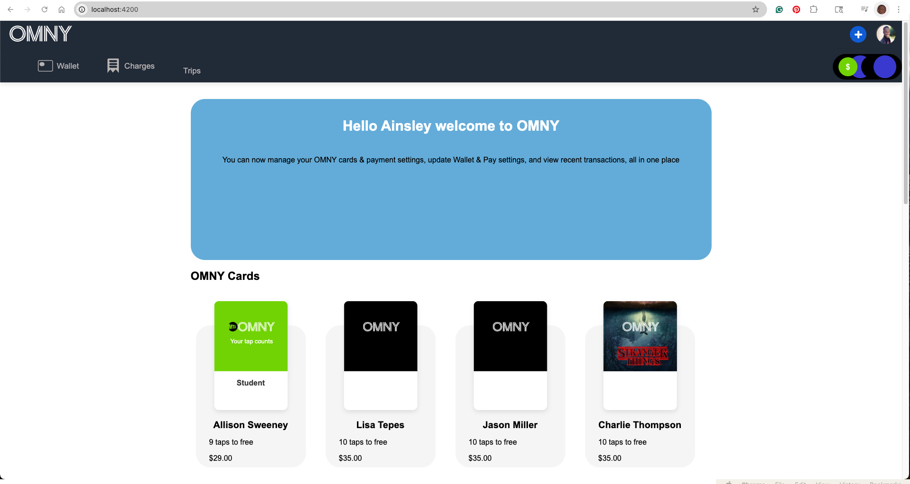

# 🚍 OMNY Fare System Simulator (Angular)

A web-based simulation of NYC’s OMNY transit fare system, built using **Angular** and **TypeScript**.  
This project simulates card taps, fare deduction, balance checks, and 7-day fare capping rules in a fully interactive browser UI.

---

## 📸 Screenshot



> Add a screenshot of the main interface or tap history panel. Place it in `screenshot/`.

---

## 🎥 Demo Video

[▶️ Watch the demo(public/screenshot.png)](https://youtu.be/your-video-id)

---

## ✨ Features

- 💳 **Card Management**: OmnyCard and DebitCard types with unique behaviors
- 🧾 **Tap Tracking**: Time-stamped entries with location and source type
- 💸 **Fare Deduction**: Tap triggers real-time balance updates
- 🧠 **7-Day Fare Cap**: Free rides automatically apply after 12 taps in a 7-day window
- 📊 **Transaction History**: View past activities by card and date
- 🧪 Built with Angular 8+ using modular components and services

---

## 🛠 Tech Stack

- **Frontend**: Angular 8+, TypeScript, HTML/CSS
- **State Management**: Local service-based (optional upgrade to NgRx)
- **UI**: Material Design (optional), CSS Grid/Flexbox for layout

---

## 🚀 Getting Started

### 🔧 Prerequisites

- Node.js 18+ and npm
- Angular CLI

### ▶️ Run Locally

```bash
git clone https://github.com/your-username/omny-angular.git
cd omny-angular
npm install
ng serve

This project was generated with [Angular CLI](https://github.com/angular/angular-cli) version 18.2.6.

## Development server

Run `ng serve` for a dev server. Navigate to `http://localhost:4200/`. The application will automatically reload if you change any of the source files.

## Code scaffolding

Run `ng generate component component-name` to generate a new component. You can also use `ng generate directive|pipe|service|class|guard|interface|enum|module`.

## Build

Run `ng build` to build the project. The build artifacts will be stored in the `dist/` directory.

## Running unit tests

Run `ng test` to execute the unit tests via [Karma](https://karma-runner.github.io).

## Running end-to-end tests

Run `ng e2e` to execute the end-to-end tests via a platform of your choice. To use this command, you need to first add a package that implements end-to-end testing capabilities.

## Further help

To get more help on the Angular CLI use `ng help` or go check out the [Angular CLI Overview and Command Reference](https://angular.dev/tools/cli) page.
